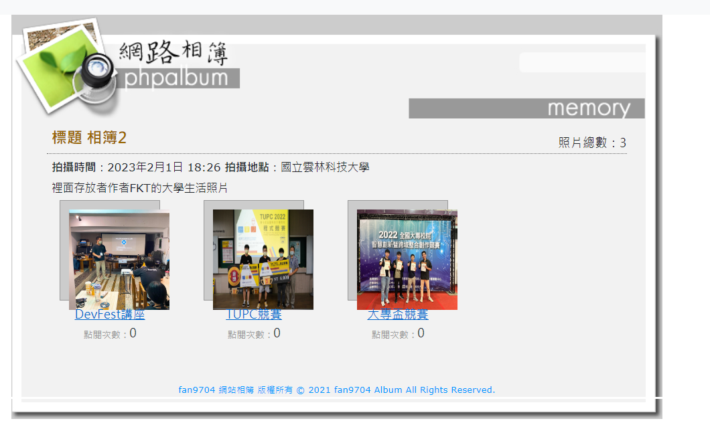
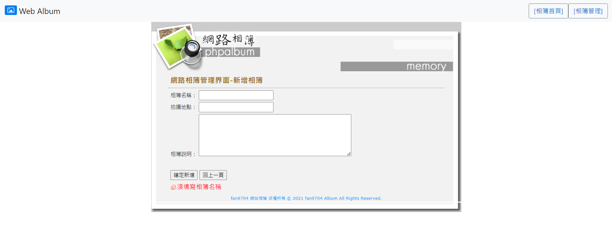
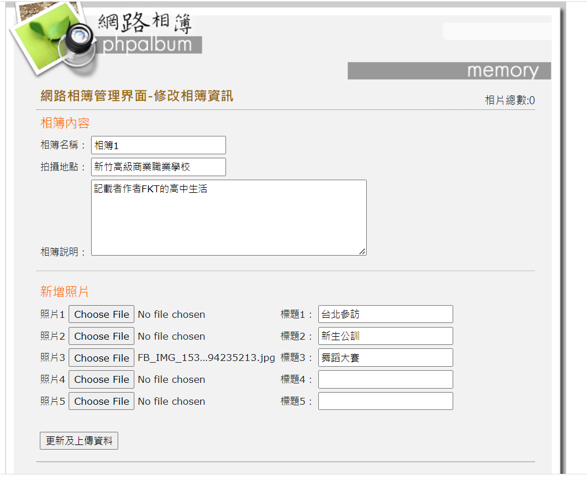
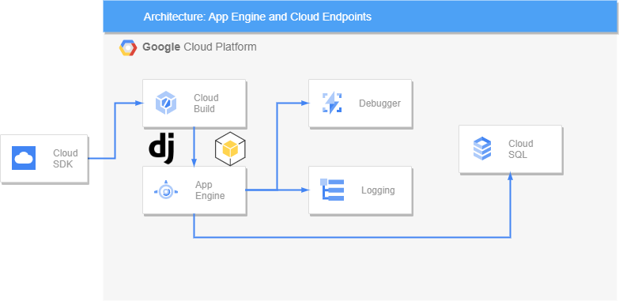

# Web Album

## Feature

### View photo in browser

> Everyone without login can access photos for free



### Create and Delete web album

> Only Administrator can do that 



### Upload new photo

> Only Administrator can do that you can upload at most 5 photos at the same time

> Administrator can give every each of photo description 



## Google Cloud Services Structure



## Setup

### Step.1 Google Cloud SQL

Create PostgreSQL in Cloud SQL
```shell

gcloud sql instances create postgre \
     --activation-policy=ALWAYS \
     --database-version=POSTGRES_14 \
     --region=asia-east2 \
     --tier=db-n1-standard-1
```

Create Database in Cloud SQL

```shell
gcloud sql databases create webalbum --instance postgre
```

After created checking database is alive in your project

```shell
gcloud sql databases list --instance webalbum
```

Setup Database Management System root password

```shell=
gcloud sql users set-password root \
     --host=% \
     --instance webalbum \
     --password=PASSWORD
```

### Step.2 Google Cloud SQL Proxy

Enter the follow commands in Cloud Shell
```shell
wget https://dl.google.com/cloudsql/cloud_sql_proxy.linux.amd64 -O cloud_sql_proxy
chmod +x cloud_sql_proxy
cloud_sql_proxy -instances=<YOUR_PROJECT_ID>:us-central1:postgre=tcp:5432
```

### Step.3 Create App Engine

```shell
gcloud app create
```

### Other

#### Run Server as localhost

.env file must create in local project

```dotenv
DJANGO_SECRET_KEY = 
DEBUG = True

POSTGRES_DB = 
POSTGRES_USER = 
POSTGRES_PASSWORD = 
POSTGRES_DB_URL = 

GAE_APPLICATION = False
```

**Note:**

1. Google App Engine not support pipenv don,t use pipenv to manage your dependencies